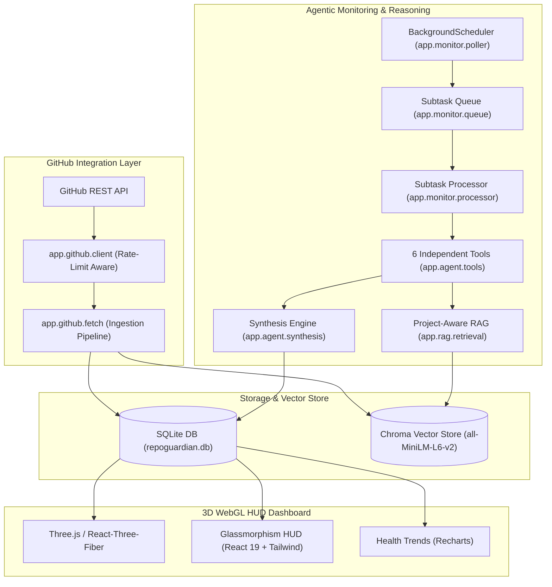

# RepoGuardian — Architecture & Technical Design

## 1. System Architecture

## 2. Component Directory Mapping

* **`backend/app/db/`**:
  * `schema.sql`: Source of truth table definitions.
  * `database.py`: Thread-safe sqlite3 connection manager & query helpers.
* **`backend/app/github/`**:
  * `client.py`: GitHub API client with rate-limit and token management.
  * `fetch.py`: Fetch, normalize, store, and cache pipeline.
* **`backend/app/rag/`**:
  * `embeddings.py`: Sentence-transformers vector embedding generation.
  * `retrieval.py`: Cosine similarity search with maintainer resolution notes.
* **`backend/app/agent/`**:
  * `tools.py`: 6 callable Python tool functions.
  * `tool_schemas.py`: Anthropic / Gemini tool schemas.
  * `synthesis.py`: Multi-step reasoning and rule-based fallback.
* **`backend/app/monitor/`**:
  * `poller.py`: Periodic GitHub poller loop.
  * `queue.py`: SQLite subtask CRUD.
  * `processor.py`: Subtask executor.
* **`backend/app/api/`**:
  * `issues.py`, `feedback.py`, `health.py`, `monitor.py`: FastAPI routers.

## 3. Project-Aware RAG (`backend/app/rag/`)

RAG here means retrieval over *this specific connected repo's own issue
history* — not a general knowledge base. Every query is scoped to one repo,
and every citation the agent produces traces back to a real row in SQLite or
Chroma, not a paraphrase or a model guess.

### Embedding model

- **`all-MiniLM-L6-v2`** (sentence-transformers, 384-dim), loaded through
  ChromaDB's `SentenceTransformerEmbeddingFunction`. Configurable via the
  `EMBEDDING_MODEL` env var, but this is the model actually shipped and
  calibrated against.
- Each issue is embedded as `title + "\n\n" + body`
  (`embeddings.format_issue_document`) — title alone was too short to
  distinguish similar-sounding but unrelated issues; title+body gave the
  calibration set enough signal to separate real duplicates from shared
  vocabulary.
- All repos share **one** Chroma collection (`repoguardian_issues`, cosine
  distance), not one collection per repo. Isolation between repos is
  enforced at query time by a `repo` field on every vector's metadata,
  filtered with `where={"repo": repo}` in `find_similar()` — verified
  directly (querying with two repos connected only ever returns matches
  from the requested repo).
- Similarity is derived as `1 - cosine_distance`, clamped to `[0, 1]`.

### Thresholds — what they are and why (`app/agent/tools.py`)

| Constant | Value | Applies to | Meaning |
|---|---|---|---|
| `DUPLICATE_SIMILARITY_THRESHOLD` | **0.75** | matches with `state == "open"` | flagged `is_likely_duplicate` |
| `REGRESSION_SIMILARITY_THRESHOLD` | **0.85** | matches with `state == "closed"` | flagged `is_possible_regression` |

Both were calibrated by hand against 100 real `httpie/cli` issues
(`backend/scripts/test_rag.py`), not guessed:

- **0.80 was tried first and rejected** — it missed real duplicate clusters
  that use different wording for the same underlying fix. Examples found in
  the calibration set: issue #1936 vs #1931 (both fixing the same
  URL-credential-decoding bug, #1623) scored 75.2% / 74.6%; a SSL/CA-cert
  fallback cluster (#1871/#1933/#1915, all fixing #1632/#480) scored
  74–83%; a pipx-install-docs cluster (#1892/#1905/#1907 — #1907 literally
  says "Closes #1905") scored 70.9–79.6%. All of these would have been
  silently missed at 0.80.
- **0.75 catches all of the above** while staying above the one confirmed
  *non-duplicate* pair in the same dataset: #1849 ("Fix option parsing
  after request arguments") vs #1852 ("Handle ASCII help output streams")
  — two genuinely different bugs that happen to share vocabulary (argparse,
  options) and sit at 72–73%. That pair is the effective floor for the
  threshold; going lower risks flagging it.
- **The regression threshold is set higher (0.85)**, deliberately, because
  it fires against *closed* issues — telling a maintainer "this looks like
  a regression of something already fixed" is a stronger, costlier claim
  than "this might be a duplicate," so it needs more evidence before firing.

### How `get_decision_context` picks which comments to surface

`get_decision_context(repo, issue_numbers)` in `retrieval.py` exists so the
agent can cite *what actually happened* to a similar issue, not just that
one looks similar to another:

1. Pull every comment on the candidate issue, oldest first.
2. Prefer comments where `is_maintainer == 1` — a real flag set at
   ingestion time (`github/fetch.py`) from the repo's actual collaborator
   list plus GitHub's `author_association` field (`OWNER` / `MEMBER` /
   `COLLABORATOR`). For rows synced before this column existed, it falls
   back to "any comment not written by the issue's own author" as an
   approximation.
3. Scan those comments against `DECISION_KEYWORDS` — a regex of resolution
   language: `duplicate of`, `won't fix`, `closed as ...`, `fixed in`,
   `by design`, `not planned`, `superseded by`, `see #N`, and similar. The
   first comment that matches is cited, along with the exact phrase that
   matched.
4. If nothing matches a decision keyword (the issue is still open, or was
   closed without an explicit resolution comment), fall back to the last 2
   comments verbatim — so the agent always has something concrete to quote
   instead of silently citing nothing.
5. Excerpts are always the real comment text, verbatim — never paraphrased
   or LLM-summarized before citation. A Step 8 audit of the last 15
   duplicate/regression escalations confirmed every cited issue number,
   title, similarity score, and quoted excerpt matched the real underlying
   data exactly.

### Known limitations

- The 0.75 threshold is calibrated against one repo's data (`httpie/cli`,
  100 issues). A repo with denser shared-vocabulary-but-different-bug
  clusters than the #1849/#1852 case found here could push false positives
  above the line; the fix would be requiring a decision-context keyword hit
  as a secondary signal, not similarity alone.
- Because excerpts are quoted verbatim, any encoding artifact already
  present in the stored comment text propagates into the cited explanation
  unchanged — observed once in the current dataset (a stray `�` in place of
  an em-dash in one `httpie/cli` comment). Source not yet confirmed
  (ingestion vs. how the row was written); either way it isn't a retrieval
  bug — fixing it means normalizing text encoding wherever the comment was
  written, not in `retrieval.py`.
- A cited match's *title* can itself contain another issue number (e.g.
  "Fix #1632: fall back to …"), which can visually read as a second match
  to someone skimming the explanation. Not a retrieval error — just a
  formatting ambiguity flagged for the synthesis explanation-copy pass.
