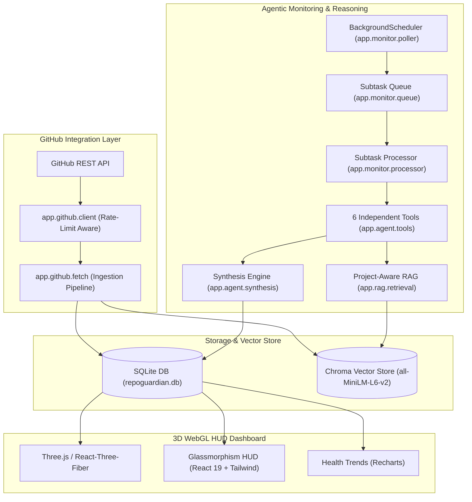

# RepoGuardian — Architecture & Technical Design

## 1. System Architecture

## 2. Component Directory Mapping

* **`backend/app/db/`**:
  * `schema.sql`: Source of truth table definitions.
  * `database.py`: Thread-safe sqlite3 connection manager & query helpers.
* **`backend/app/github/`**:
  * `client.py`: GitHub API client with rate-limit and token management.
  * `fetch.py`: Fetch, normalize, store, and cache pipeline.
* **`backend/app/rag/`**:
  * `embeddings.py`: Sentence-transformers vector embedding generation.
  * `retrieval.py`: Cosine similarity search with maintainer resolution notes.
* **`backend/app/agent/`**:
  * `tools.py`: 6 callable Python tool functions.
  * `tool_schemas.py`: Anthropic / Gemini tool schemas.
  * `synthesis.py`: Multi-step reasoning and rule-based fallback.
* **`backend/app/monitor/`**:
  * `poller.py`: Periodic GitHub poller loop.
  * `queue.py`: SQLite subtask CRUD.
  * `processor.py`: Subtask executor.
* **`backend/app/api/`**:
  * `issues.py`, `feedback.py`, `health.py`, `monitor.py`: FastAPI routers.
